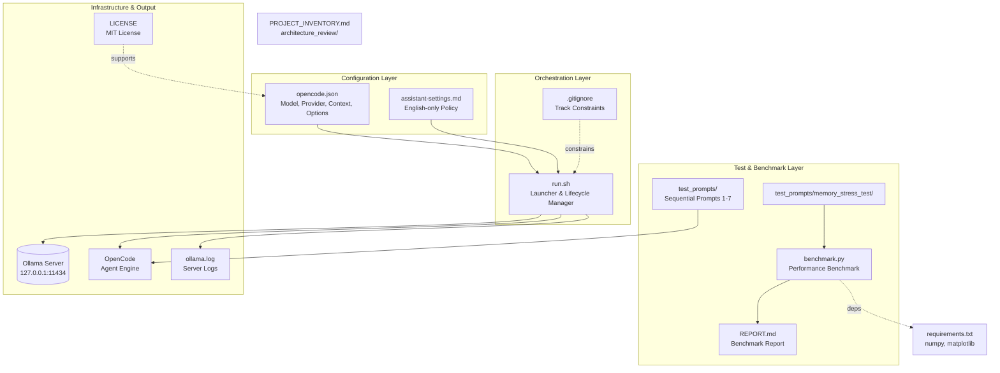

# Architecture Review

This document provides a comprehensive architecture analysis of the OpenCode Test Project workspace, covering system components, data flow, configuration interaction, and architectural coupling. All evidence is drawn from the actual project files.

## System Overview

The project is a **local testing environment for OpenCode (agent-based coding tool)** configured with a local **Ollama** model. It serves as a reproducible workspace for automated testing, benchmarking, and code agent evaluation tasks.

The system consists of three interacting layers:

1. **Configuration Layer** — Defines the model, provider, context window, and prediction limits via `opencode.json` and `assistant-settings.md`.
2. **Orchestration Layer** — Provides `run.sh`, a bash launcher that manages Ollama server lifecycle, model validation, and OpenCode execution.
3. **Test & Benchmark Layer** — Contains `test_prompts/` directory with sequential prompt files for agent evaluation, and `memory_stress_test/` with a performance benchmark application.

## Components and Data Flow

### Components

| Component | File Path | Responsibility |
| --- | --- | --- |
| Configuration | `opencode.json` | Specifies OpenCode model, Ollama provider, context window (65536), max prediction (512), and tool usage settings. |
| Configuration | `assistant-settings.md` | Sets language lock (English-only) and response policy with priority over other preferences. |
| Launcher | `run.sh` | Validates prerequisites, starts/starts Ollama server, verifies model availability, runs health check, launches OpenCode. |
| Test Prompts | `test_prompts/*.md` | Sequential agent evaluation prompts (1–7) and benchmark specifications. |
| Benchmark | `test_prompts/memory_stress_test/benchmark.py` | Measures CPU, memory, file I/O, and multithreaded performance under controlled stress. |
| Benchmark Dependencies | `test_prompts/memory_stress_test/requirements.txt` | Declares `numpy` and `matplotlib` with minimum version constraints. |
| Benchmark Report | `test_prompts/memory_stress_test/REPORT.md` | Documents methodology, results, bottleneck analysis, and recommendations. |
| Infrastructure | `.gitignore` | Constrains git tracking of generated artifacts, caches, logs, and editor files. |
| Logging | `ollama.log` | Captures Ollama server output during launch and health checks. |
| License | `LICENSE` | MIT License for project use and distribution. |
| Project Inventory | `architecture_review/PROJECT_INVENTORY.md` | Inventory of all files grouped by purpose with dependencies. |

### Data Flow

```
[opencode.json] ──config──▶ [run.sh] ──launch──▶ [Ollama Server]
                                │                        │
                                │                        ├──▶ [ollama.log] (logging)
                                │                        ├──▶ [model check] ──▶ [OPENCODE_MODEL]
                                │                        └──▶ [OpenCode]
                                │
[assistant-settings.md] ──policy──▶ [run.sh] ──────────────────────────▶ [OpenCode]
                                │
[test_prompts/*.md] ──specs────▶ [OpenCode execution]
[benchmark.py] ──inference────▶ [numpy/matplotlib] ──▶ [REPORT.md]
```

**Key Data Flow Steps:**

1. **Configuration Loading:** `run.sh` reads `opencode.json` for model/provider settings and `assistant-settings.md` for language policy.
2. **Server Lifecycle:** If Ollama is not running, `run.sh` starts it, waits up to 30 seconds for readiness, and logs to `ollama.log`.
3. **Model Validation:** `run.sh` checks if the target model exists via `ollama list`, pulling it if missing, then runs a health check with `curl` against `/api/generate`.
4. **OpenCode Execution:** After validation, `run.sh` launches OpenCode with the configured model, passing through user arguments.
5. **Test Prompt Execution:** Test prompt files in `test_prompts/` are executed sequentially by OpenCode, operating on the same project workspace.
6. **Benchmark Execution:** `benchmark.py` runs CPU, memory, file I/O, and multithreaded benchmarks, collects metrics, and generates graphs and reports.

## Architecture Diagram



## Coupling and Boundaries

### Coupling Analysis

| Coupling | Description | Evidence |
| --- | --- | --- |
| **Configuration–Launcher** | `run.sh` directly depends on `opencode.json` for model/provider config and `assistant-settings.md` for policy. Hardcoded defaults fall back to config values. | `run.sh` reads `${OLLAMA_MODEL:-SparkLLM/Spark-X2.5-4B:latest}` and `opencode.json` model field. |
| **Launcher–Server** | `run.sh` tightly couples with Ollama server lifecycle — starts, monitors readiness (up to 30s), and checks model via API calls. | `run.sh` uses `curl` against `/api/tags` and `/api/generate` with `set -euo pipefail`. |
| **Launcher–OpenCode** | `run.sh` passes the configured model to OpenCode via `--model` flag, coupling execution to model availability. | `exec opencode --model "${OPENCODE_MODEL}" "$@"` |
| **Benchmark–Dependencies** | `benchmark.py` depends on `numpy` and `matplotlib` (declared in `requirements.txt`), with hardcoded minimum versions. | `requirements.txt` pins `matplotlib>=3.7.0`, `numpy>=1.24.0`. |
| **Test Prompts–Workspace** | All test prompts operate on the same project workspace, sharing configuration and code files. | `test_prompts/*.md` describe tasks operating on the same workspace as `opencode.json` and `run.sh`. |
| **Infrastructure–Tracking** | `.gitignore` constrains what is tracked by git, coupling the workflow to version control. | `.gitignore` excludes `.venv/`, `*.log`, `.benchmark_results/`, editor files, etc. |

### Boundary Analysis

- **Orchestration vs. Test Layer:** `run.sh` is the sole entry point for OpenCode execution and server management, creating a clean boundary between infrastructure and test/benchmark workflows.
- **Configuration vs. Execution:** The configuration layer (`opencode.json`, `assistant-settings.md`) is decoupled from runtime logic — changes to config require re-invocation of `run.sh`.
- **Benchmark Isolation:** The `memory_stress_test/` directory is self-contained, with its own requirements and report, isolating benchmark execution from the main project.
- **Read-Only Audit Scope:** Prompt 7 (stress test) enforces a strict read-only boundary, preventing accidental modification of existing files — a boundary that constrains agent behavior.

### Potential Failure Points

1. **Ollama Server Unavailability:** If Ollama fails to start or the model is not installed, `run.sh` exits with an error and logs to `ollama.log`. Risk: non-deterministic startup, dependent on external service.
2. **Context Window Exhaustion:** With a 65536 token context and 512 max prediction, long-running OpenCode sessions risk exceeding context limits, potentially losing earlier instructions or context.
3. **Shell Command Injection:** `run.sh` uses `$(...)` substitution in `curl` commands to build JSON payloads. Malformed or injected content in variables could affect command construction.
4. **Resource Contention:** Local Ollama server and multithreaded benchmark consume CPU/memory simultaneously, potentially causing resource exhaustion.
5. **Dependency Version Mismatch:** Hardcoded minimum versions (`numpy>=1.24.0`, `matplotlib>=3.7.0`) may conflict with existing installed versions, causing runtime failures.

## Recommendations

1. **Pre-validation in `run.sh`:** Add explicit pre-checks for Ollama server availability before attempting to start it, with clearer error messages and log tailing on failure.
2. **Context Management:** Implement context window monitoring and checkpointing for long-running OpenCode sessions to prevent context exhaustion.
3. **Input Validation in `run.sh`:** Validate all variables/inputs before shell command interpolation, avoiding `$(...)` substitution where possible.
4. **Resource Isolation:** Add resource monitoring and limits for the benchmark and Ollama server to prevent concurrent resource contention.
5. **Dependency Locking:** Consider pinning exact versions or adding version conflict pre-checks for `numpy` and `matplotlib`.

---

*Document generated as part of Prompt 2 (Long Context Research) — Architecture Review. All evidence cited from project files: `opencode.json`, `run.sh`, `assistant-settings.md`, `.gitignore`, `test_prompts/*`, `test_prompts/memory_stress_test/*`, `README.md`, `LICENSE`.*
