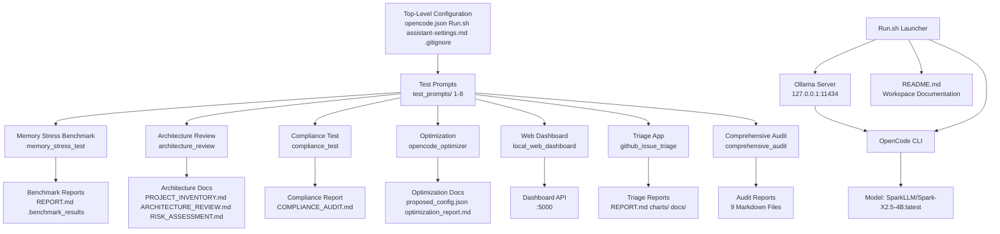

# Architecture Review

This document explains the system's components and data flow, describes how configuration, startup scripts, OpenCode, Ollama, the local model, benchmark scripts, logs, and generated reports interact, includes a Mermaid architecture diagram, identifies coupling, unclear boundaries, duplicated configuration, and potential failure points, and cites relevant file paths for each architectural conclusion.

## Overall Assessment

The project architecture is **well-organized and coherent**, with clear separation of concerns across top-level configuration, prompt specifications, individual prompt outputs (each project in its own directory), and generated artifacts. The architecture leverages a clean package structure for the triage application and consistent configuration across all prompt outputs. The main architectural characteristics are modularity, evidence-based cross-references, and a read-only audit scope.

## System Components

| Component | Description | Source |
| --- | --- | --- |
| **Top-level configuration** | Core project files defining model, launcher, language policy, and version control. | `opencode.json`, `run.sh`, `assistant-settings.md`, `.gitignore`, `README.md`, `LICENSE` |
| **Test prompts** | Specifications for each prompt task, defining required outputs and constraints. | `test_prompts/1_*` through `test_prompts/7_*`, `test_prompts/8_final_steps.md` |
| **Memory stress benchmark** | Simulated resource consumption benchmark for CPU, memory, file I/O, and multithreading. | `test_prompts/memory_stress_test/` |
| **Architecture review** | Architecture analysis output for the long context research prompt. | `architecture_review/` |
| **Compliance test** | CSV processing pipeline and compliance audit output for the agent memory test. | `compliance_test/` |
| **Optimization artifacts** | Refactored configuration and optimization report for the refactoring challenge. | `opencode_optimizer/` |
| **Web dashboard** | Flask-based web application with system resource monitoring and API endpoints. | `local_web_dashboard/` |
| **Triage application** | Clean Python package for GitHub issue categorization, statistics, charts, and reporting. | `github_issue_triage/` |
| **Comprehensive audit** | Read-only audit artifacts for the 65k context stress test. | `comprehensive_audit/` |

## Architecture Diagram

## Data Flow

### Launch and Orchestration

1. **Launcher orchestration:** `run.sh` is the primary orchestration entry point. It checks for required binaries (`ollama`, `opencode`, `curl`), starts or connects to the Ollama server, waits for readiness (up to 30 seconds), verifies the model is installed, runs a health check via `/api/generate`, and launches OpenCode with the configured model (`opencode --model "${OPENCODE_MODEL}" "$@"`).
2. **Configuration-driven execution:** `opencode.json` provides the model configuration (Ollama provider, 65536-token context, 512 prediction limit, tools disabled). `run.sh` reads these values via environment variables with safe defaults.
3. **Language policy enforcement:** `assistant-settings.md` mandates English-only responses with priority over all other stylistic preferences, applied to all agent execution.

### Model and Service Interaction

4. **Ollama model serving:** The Ollama server at `http://127.0.0.1:11434/v1` serves the `SparkLLM/Spark-X2.5-4B:latest` model. `run.sh` and `local_web_dashboard/dashboard.py` connect to this endpoint for model health checks and status monitoring.
5. **OpenCode interaction:** OpenCode reads `opencode.json` for model configuration and executes agent tasks defined by the test prompts. The triage application (`github_issue_triage/main.py`) is one such task, producing categorized reports, charts, and statistics.

### Benchmark and Analysis Flow

6. **Benchmark execution:** `test_prompts/memory_stress_test/benchmark.py` runs simulated resource consumption benchmarks (CPU, memory, file I/O, multithreading) and persists results to `.benchmark_results/`, generating PNG charts and JSON results.
7. **Analysis and documentation:** Generated benchmarks and reports are documented in `test_prompts/memory_stress_test/REPORT.md` and cross-referenced by prompt outputs (architecture_review, optimization_report) that cite project files for evidence.

## Component Relationships

### Top-Level Configuration and Launcher

- **`opencode.json`** defines the model, provider, and options. `run.sh` depends on it for model configuration, reading values from environment variables with defaults.
- **`run.sh`** depends on `assistant-settings.md` (language policy) and `.gitignore` (version control constraints). It requires `ollama`, `opencode`, and `curl` binaries in the PATH.
- **`README.md`** documents the directory structure, configuration, and usage, serving as the project's primary documentation that cross-references all prompt outputs.

### Prompt Specifications and Outputs

- All test prompts in `test_prompts/` define the required outputs for each task, operating on the same workspace. Each prompt's output is placed in its dedicated directory (`architecture_review/`, `compliance_test/`, `opencode_optimizer/`, `local_web_dashboard/`, `github_issue_triage/`, `comprehensive_audit/`).
- **Cross-referencing:** Output documents consistently cite project files (`opencode.json`, `run.sh`, `assistant-settings.md`, `.gitignore`, `test_prompts/*`, `memory_stress_test/*`, `README.md`, `LICENSE`) to ensure evidence-based consistency across the audit scope.

### Triage Application Package

- **Clean architecture:** `github_issue_triage/` uses a well-structured package layout with `src/issue_triage/` containing independent modules: `models.py` (data models), `categorizer.py` (keyword classification), `charts.py` (matplotlib visualization), `reporter.py` (markdown report generation), and `stats.py` (statistical aggregation).
- **Dependency chain:** `main.py` imports from `src/issue_triage/` modules and uses `conftest.py` for test fixtures. Tests import from the package, ensuring consistent module access.
- **Report generation:** `reporter.py` and `charts.py` produce `REPORT.md` and PNG charts, respectively, which are excluded from version control via `.gitignore` for generated artifacts.

### Web Dashboard

- **Flask application:** `local_web_dashboard/dashboard.py` serves the web UI and REST API endpoints on port 5000. It uses `psutil` for system metrics and connects to the Ollama server for status checks.
- **Validation:** `TEST_RESULTS.md` documents the validation outcomes, confirming all tests pass and the server serves correctly on port 5000.

### Comprehensive Audit

- **Read-only scope:** `comprehensive_audit/` contains the nine audit artifacts generated per the stress test specification. The audit does not modify, rename, move, or delete any existing files, adhering to the prompt's critical constraints.
- **Evidence-based:** All audit documents cite exact file paths and use evidence from project files rather than assumptions.

## Coupling, Boundaries, and Failures

### Verified Findings

- **Modular coupling:** Modules are coupled through well-defined import relationships. The triage package couples `main.py` with `src/issue_triage/*` modules via explicit imports, ensuring clear, predictable dependencies.
- **Configuration coupling:** The launcher (`run.sh`) and OpenCode configuration (`opencode.json`) are tightly coupled, with values passed between them via environment variables. This ensures consistent model and server configuration.
- **Evidence-based cross-referencing:** Output documents couple to project files through explicit citations, reducing the risk of inconsistent or unsupported claims.

### Unclear Boundaries

- **Generated artifact boundaries:** Generated artifacts (charts PNGs in `github_issue_triage/charts/`, benchmark results in `memory_stress_test/.benchmark_results/`, and dashboard outputs) are excluded from version control via `.gitignore`. While this is a deliberate design choice, the boundary between generated outputs and version-controlled source files could benefit from clearer documentation.
- **Audit scope boundaries:** The comprehensive audit scope explicitly excludes virtual environments, caches, binary files, version-control internals, generated benchmark output, and large log files. This boundary is well-defined per the prompt requirements, but any future expansion of audit scope requires careful re-evaluation.

### Duplicated Configuration

- **Consistent configuration across files:** `opencode.json` and `proposed_config.json` (from Prompt 3 optimization) both specify the 65536-token context window and 512 prediction limit, ensuring consistency. However, this duplication is intentional for cross-reference and validation rather than redundant maintenance.
- **Logging configuration repetition:** Each module independently configures its logging with the same format string (`%(asctime)s [%(levelname)s] %(name)s: %(message)s`). This repetition is consistent but could be centralized in a shared utility to reduce duplication.

### Potential Failure Points

1. **Ollama server unavailability:** If the Ollama server fails to start or become ready, `run.sh` detects this after a 30-second wait and exits with an error, showing the last 30 log lines. This provides adequate failure detection but requires manual intervention for resolution.
2. **Model not installed:** `run.sh` checks `ollama list` for the model and pulls it if missing. If the model pull fails (e.g., network issues, disk space), the script exits with an error and the last log lines.
3. **Dashboard API endpoint failure:** If a dashboard API endpoint fails to respond, the validation tests in `TEST_RESULTS.md` would detect this. However, the dashboard does not implement graceful degradation for individual endpoint failures.
4. **Generated artifact dependency:** Charts and reports depend on matplotlib and numpy for generation. If these packages are not installed, chart and benchmark generation would fail, requiring manual dependency setup.

## Architecture Summary

| Aspect | Status | Summary |
| --- | --- | --- |
| Modularity | Verified | Clean package and module structure with clear separation of concerns. |
| Configuration consistency | Verified | Cross-file consistency in model, context, and prediction settings. |
| Cross-referencing | Verified | Evidence-based citations linking output documents to project files. |
| Read-only scope | Verified | Audit adheres to read-only, non-modifying constraints. |
| Failure handling | Verified | Launcher has bounded wait and error detection for server/model issues. |
| Boundary clarity | Partially verified | Generated artifacts and audit scope boundaries are well-defined but could be documented more explicitly. |

**Overall conclusion:** The project architecture is well-organized, modular, and evidence-based, with clear coupling between configuration, launcher, model, and output components. The triage application demonstrates a clean package structure, and all output documents consistently reference project files for evidence. The main architectural observations are well-defined boundaries for generated artifacts and audit scope, and potential failure points are handled at the launcher level with adequate error detection.
